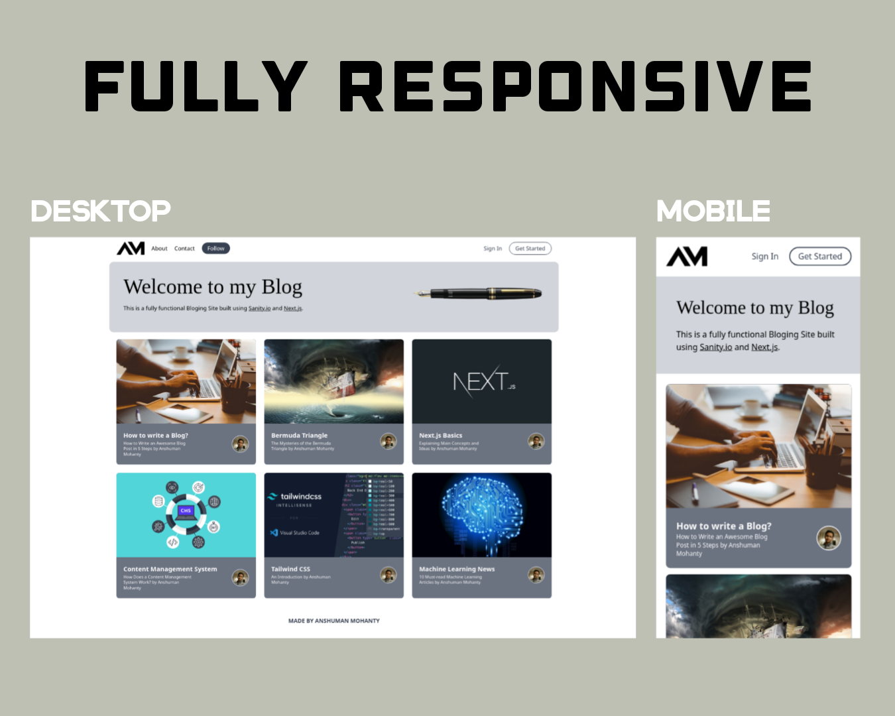
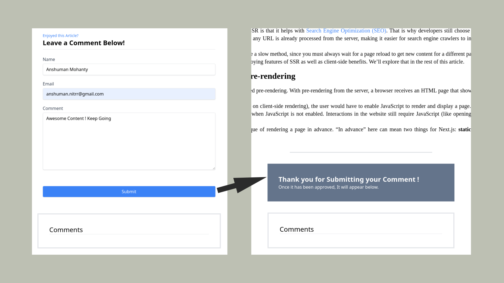
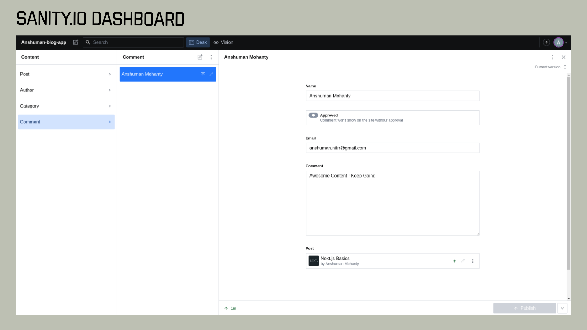
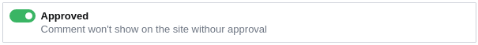
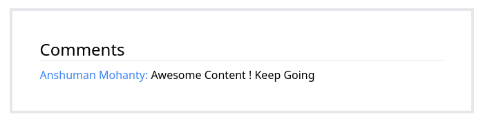

<p align="center">
  <a>
    
    <h1 align="center">Personal Blogging Website using <a href="https://nextjs.org/">Next.js</a> and <a href="https://www.sanity.io/">Sanity.io</a></h1>
  </a>
</p>


>Inspired from [Medium.com](https://medium.com/). This Website is built using Next.js with TailwindCSS and Sanity.io as my CMS(Content Management System).</br></br>

# Fully Responsive Website



# Fully Functional Comment Feature
>On Submission, the Comment goes straight to the Sanity CMS and get logged there.
> 


>Here we can see, the Stored Comments on Sanity CMS. 
> 


>To show the comment on the Blog page, we(moderator) have/has to approve the comment.  
> 


>Voila!!! Our Comment is Live on the Blog Page.
> 



## Getting Started with Next.js

Visit <a aria-label="next.js learn" href="https://nextjs.org/learn">https://nextjs.org/learn</a> to get started with Next.js.

- To run the Next.js Server : 
<code>npm run dev</code>


## Getting Started with Sanity.io

- To run the Sanity Dashboard : 
<code>cd anshumanblogapp</code> then
 <code>sanity start</code>
 
 - To Install Sanity Studio : 
<code>cd anshumanblogapp</code> then
 <code>sanity deploy</code>


## Deploy your own

You can deploy the above website using [Vercel](https://vercel.com?utm_source=github&utm_medium=readme&utm_campaign=next-example):

[](https://vercel.com/new/git/external?repository-url=https://github.com/vercel/next.js/tree/canary/examples/with-tailwindcss&project-name=with-tailwindcss&repository-name=with-tailwindcss)

## How to use

Execute [`create-next-app`](https://github.com/vercel/next.js/tree/canary/packages/create-next-app) with [npm](https://docs.npmjs.com/cli/init) or [Yarn](https://yarnpkg.com/lang/en/docs/cli/create/) to bootstrap the example:

```bash
npx create-next-app --example with-tailwindcss with-tailwindcss-app
# or
yarn create next-app --example with-tailwindcss with-tailwindcss-app
```

Deploy it to the cloud with [Vercel](https://vercel.com/new?utm_source=github&utm_medium=readme&utm_campaign=next-example) ([Documentation](https://nextjs.org/docs/deployment)).
